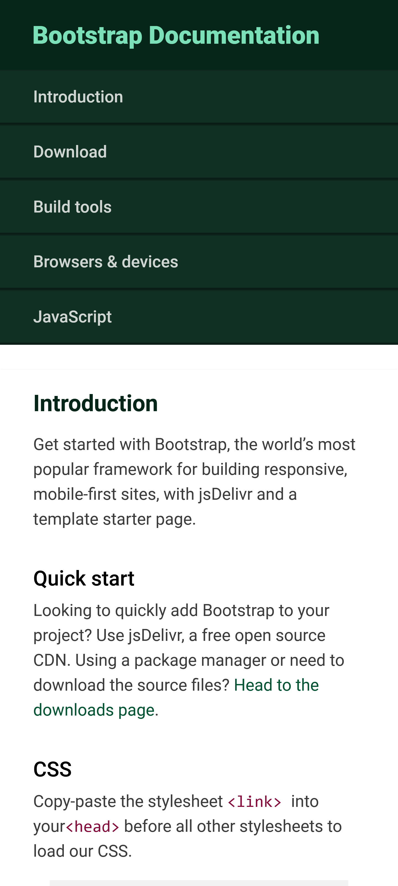

# FreeCodeCamp - Tecnical documentaion project

This project is focused on building an app that is functionally similar to [FreeCodeCamp javascript documentation](https://technical-documentation-page.freecodecamp.rocks/).

## Table of contents

- [Overview](#overview)
  - [User Stories](#user-stories)
  - [Screenshot](#screenshot)
  - [Links](#links)
- [My process](#my-process)
  - [Built with](#built-with)
  - [What I learned](#what-i-learned)
  - [Useful resources](#useful-resources)
- [Author](#author)

## Overview

### User Stories

The following guidelines were provided:

- You can see a main element with a corresponding id="main-doc", which contains the page's main content (technical documentation)

- Within the #main-doc element, you can see several section elements, each with a class of main-section. There should be a minimum of five

- The first element within each .main-section should be a header element, which contains text that describes the topic of that section.

- Each section element with the class of main-section should also have an id that corresponds with the text of each header contained within it. Any spaces should be replaced with underscores (e.g. The section that contains the header "JavaScript and Java" should have a corresponding id="JavaScript_and_Java")

- The .main-section elements should contain at least ten p elements total (not each)

- The .main-section elements should contain at least five code elements total (not each)

- The .main-section elements should contain at least five li items total (not each)

- You can see a nav element with a corresponding id="navbar"

- The navbar element should contain one header element which contains text that describes the topic of the technical documentation

- Additionally, the navbar should contain link (a) elements with the class of nav-link. There should be one for every element with the class main-section

- The header element in the #navbar must come before any link (a) elements in the navbar

- Each element with the class of nav-link should contain text that corresponds to the header text within each section (e.g. if you have a "Hello world" section/header, your navbar should have an element which contains the text "Hello world")

- When you click on a navbar element, the page should navigate to the corresponding section of the #main-doc element (e.g. If you click on a .nav-link element that contains the text "Hello world", the page navigates to a section element with that id, and contains the corresponding header)

- On regular sized devices (laptops, desktops), the element with id="navbar" should be shown on the left side of the screen and should always be visible to the user

- Your technical documentation should use at least one media query

### Screenshot




### Links

- Live Site URL: [preview website](https://kushyzee.github.io/Bootstrap-technical-documentation-project/)

## My process

### Built with

- Semantic HTML5 markup
- CSS custom properties
- Mobile-first workflow

### What I learned

I ran into a problem where I couldn't figure out how to fix the sidebar to the left without messing up my entire layout. I spent hours trying to figure out what was wrong but I couldn't, so I checked youtube for a sidebar tutorial. I found one and i realised my mistake; I was using grid to push the sidebar to the left and then adding a `position: fixed` just messed up the whole thing. i fixed it with:

```css
.top-header {
  position: fixed;
  top: 0;
  left: 0;
  width: 380px;
  height: 100%;
}
```

That seemed to do the trick. I gave a `margin-left: 380px` to the other items to push them to the right of the sidebar with adequate spacing in between

2. Another problem came up where the rest of the items not in the sidebar stretched out completely and there was a horizontal overflow with sidebar. I tried various method to make it responsive and after close to an hour of trying, I figured it out. I assumed it was because I added the `margin-left: 360px` to the main container holding all the `<section>`s that is causing it, so i removed it and added it to individual `<section>`s instead and it worked. I also tried wrapping all the `<section>` element in another container and that also worked

### Useful resources

- [Sidebar Menu using HTML & CSS](https://youtu.be/V0O4pY2xX10) - This youtube tutorial by CodingNepal helped me figure out how to fix the sidebar to the right. I also learnt a lot of tricks from other videos on his channel.

## Author

- Twitter - [@kushyzeena](https://www.twitter.com/kushyzeena)
